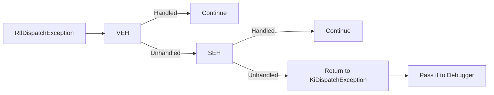

# SEH inside VEH

This project is a demonstration of implementing the functionality of x86 SEH from the Windows kernel into VEH, all in order to support non-SafeSEH handlers without disabling SafeSEH anywhere or DEP in the main image. This scenario could happen from a few reasons but some examples could be executing code embedded into another process that has SafeSEH enabled, not registering your module into the Inverted Function Table, or just simply not registering handlers as safe. This solution to the problem could be desirable over ones because you avoid hooks, avoid pattern searching for inverted table functions (e.g. RtlInsertInvertedFunctionTable), avoid finding the actual inverted function table (LdrpInvertedFunctionTable), and get to keep DEP enabled. As shown with the graph, VEH occurs before SEH and this project capitalizes on that by implementing the procedures for SEH inside VEH. 

## How to use the library?

Check the folder [SEH inside VEH](SEH%20inside%20VEH) for instructions and explanations of this library. This is a **C++** library.

**IMPORTANT:** *This library is only compatible with x86*

## Good articles
### [Dive into exceptions: caution, this may be hard](https://hackmag.com/uncategorized/exceptions-for-hardcore-users/)  <--- Pseudocode of RtlIsValidHandler looks wrong
### [Understanding Windows Structured Exception Handling](https://limbioliong.wordpress.com/2022/01/09/understanding-windows-structured-exception-handling-part-1/)
### [How a C++ compiler implements exception handling](https://www.codeproject.com/Articles/2126/How-a-C-compiler-implements-exception-handling)
### [Memory protection mechanisms in Windows](https://www.cnblogs.com/hyq20135317/p/6377880.html)
